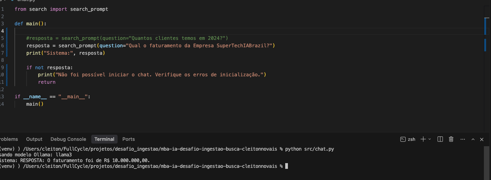
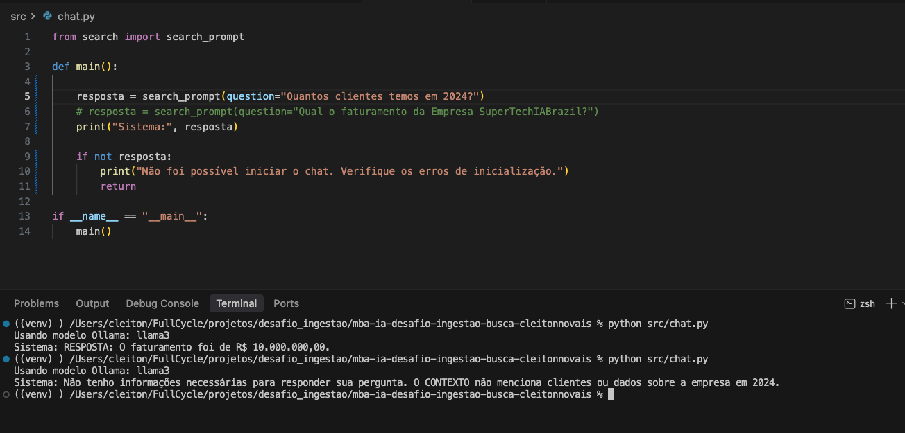

# Desafio MBA Engenharia de Software com IA - Full Cycle

Descreva abaixo como executar a sua solução.

## Como rodar o projeto

## Instalar Dependências
pip install -r requirements.txt

## Crie e ative um ambiente virtual antes de instalar dependências:
python3 -m venv venv
source venv/bin/activate

## Ordem de execução
    1. Subir o banco de dados
    2. Executar ingestão do PDF(python src/ingest.py)
    3. Rodar o chat ( python src/chat.py )

## Instalar a versão do pyhton 3.12 para funcionar.
Instalar Python 3.12:
brew install python@3.12

## Recriar o ambiente com 3.12

cd PATH_DO_SEU_PROJETO
deactivate 2>/dev/null || true
rm -rf venv
/opt/homebrew/bin/python3.12 -m venv venv
source venv/bin/activate
python -V

## Instalar Dependencias
pip install -U pip
pip install -r requirements.txt

## Subir o projeto
Subir o serviço e o postgre
docker compose up -d

## Como utilizar o chat
Com o banco no ar e o ambiente virtual ativo, siga:

1. Execute a ingestao do PDF para popular o PGVector:
python src/ingest.py

2. Inicie o chat interativo:
python src/chat.py

3. No menu do chat:
- Digite 1 ou 2 para usar perguntas prontas
- Digite 0 para escrever uma pergunta manualmente
- Digite sair (ou exit/quit) para encerrar

4. Fluxo esperado:
- Voce pergunta
- O sistema busca contexto no banco vetorial
- O bot responde com base no contexto encontrado

## Evidências

### Com contexto (resposta com base no documento)

### Sem contexto (informação não presente no documento)

